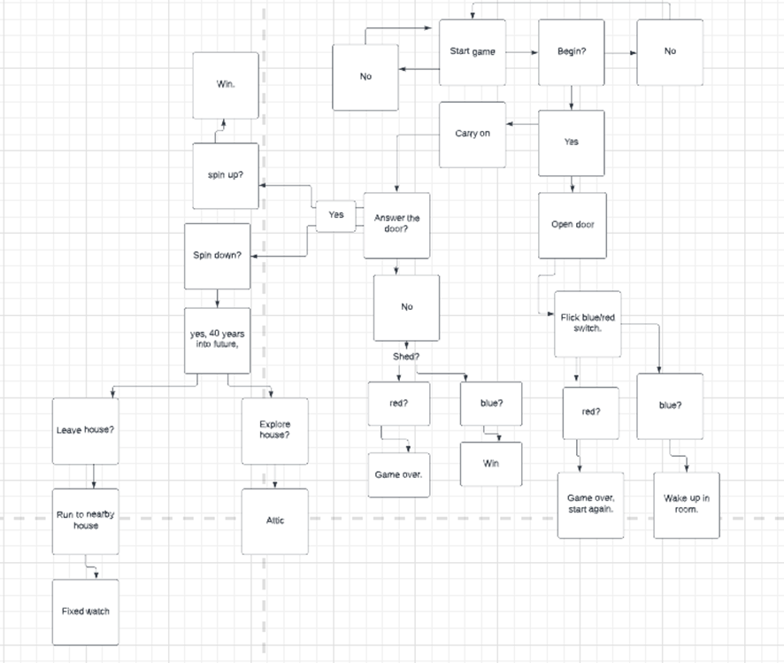
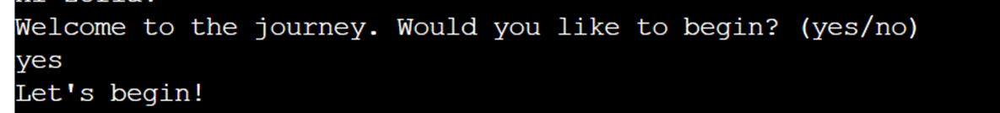

# Time Travel
The Time Travel Game runs on Heroku and is a terminal game.
It is a choice based game, where the player's input determines what happens

## How to play
The user must read the text as it appears on the screen and choose between two options provided.
The game has several choices, which determine how the game would end.
One of the first questions asked is "What's your name?", which is later fed back in the game when referring to the player.
The aim is to time travel to the future, as the game begins in 1920.
The player must try to pick the right choices to move back to the current year.
When the player manages to return to the present moment a congratulating message appears.
Some outcomes lead to a "Game over" message if the player lost.
After winning and losing the game automatically restarts.

## Features
There is one main page from which the game operates and allows the user to submit their responses

### Existing features
Questions for the player and a selection of answers they can choose:

Sometimes the game confirms the choices made by the user by feeding back the answer:

If the player inputs an answer that isn't within the list of options a message appears:

During the game lines of text appear, telling a story. The output depends on the choices the player makes throughout the game:

When the player loses the game or decides they no longer want to play the game is reset and a goodbye message appears:

### Future Features
More options within the game to make it slightly longer.

## Data model
The game is based on a story which unfolds. The direction and outcome depend on the user's choice e.g., "answer/ignore".
The text of the story is printed using "print_text" and the player is referred to by their name in the game using an f string: print_text(f"Hi {name}!", 2)
The 2 after every line of text is the amount of time delayed between each printed line.
The flowchart for this game was created using Lucidchart:

## Testing

### Bugs
The bugs I came across with pylint:
1. ms-toolsai.jupyter extension is not synced, but not added in .gitpod.yml:
Fixed by clicking on the options in QuickFixes for .gitpod.yml
2. Constant name "name" doesn't conform to UPPER_CASE naming stylepylint(invalid-name):
Fixed by changing "name" to "NAME" on line 50, 51 and within the rest of the code.
3. Using the global statementpylint(global-statement):
The third bug was fixed by moving 'NAME' to the keywords file and adding it to the imported keywords list in run.py.

### User stories:
- As a new user I would like to operate using simple words and make decisions within the game:

- I would like to quickly understand how the game works when starting it.
- I would like to receive confirmation of my choices whenever I decide about the course of the game.
- I would like to play the game in the form of an interactive story, which contains a timeline and a plot.

### Remaining bugs
All bugs have been fixed.
### Validator testing
The game has been tested using PEP8 Python Validator and returned no problems.

## Deployment

## Credits
Code Institute has provided the template for this project.
The flowchart for this game was made using Lucidchart
Stackoverflow was used for guidance and help when creating this project.
